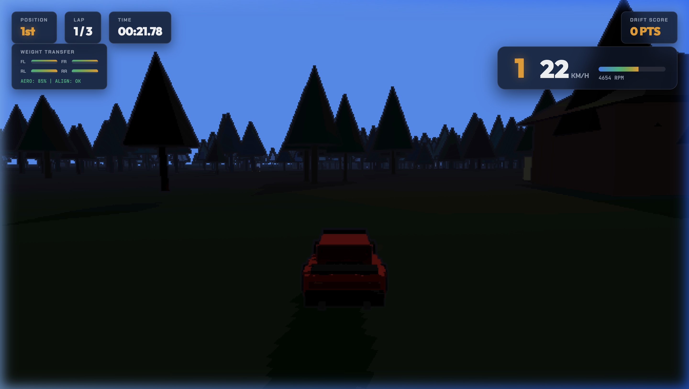
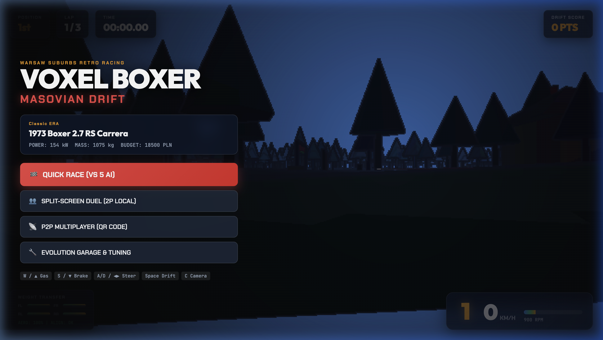
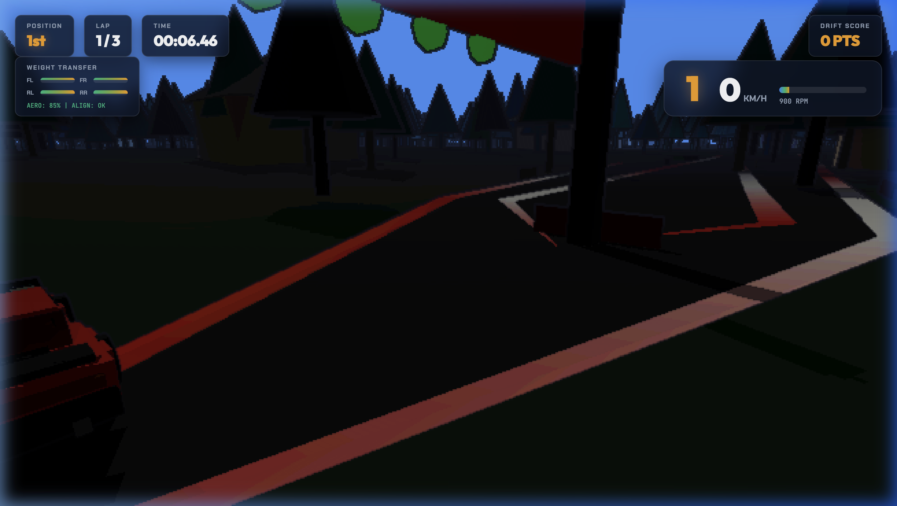

# Voxel Boxer: Masovian Drift

[](https://github.com/FranekJemiolo/masovian-drift/actions/workflows/deploy.yml)
[](https://franekjemiolo.github.io/masovian-drift/)
[](LICENSE)

> **Play Live Now:** [https://franekjemiolo.github.io/masovian-drift/](https://franekjemiolo.github.io/masovian-drift/)

**Voxel Boxer: Masovian Drift** is a high-performance, client-side WebGL voxel racing simulator designed for desktop and mobile browsers. Heavily inspired by the iconic rear-engine weight-transfer driving dynamics of classic early-2000s titles like *Need for Speed: Porsche Unleashed*, the game runs at a locked 60 FPS without external 3D models or audio sample packs. All assets are generated procedurally through code, and all engine sounds are synthesized in real time via the Web Audio API.

---

## 🎮 Screenshot Gallery

<p align="center">
  
</p>

| Main Menu & Garage | Starting Grid & Świdermajer Setting |
| :---: | :---: |
|  |  |


---

## 🌟 Key Features & Architectural Pillars

### 1. Pure Procedural Graphics & Pixel-Art Shader (Three.js)
- **Pixel-Art Post-Processing**: Custom multi-pass post-processing shader rendering downscaled FBOs with nearest-neighbor scaling and a Sobel edge-detection filter for crisp retro voxel contours.
- **Instanced World Generation**: Procedurally generated pine forests and historic wooden *Świdermajer* summer villas along the Otwock/Józefów line around Warsaw, batched into Three.js `InstancedMesh` draw calls to maintain 60 FPS even on mobile GPUs.
- **Cinematic Follow Camera**: Non-linear damping camera using `Vector3.lerp` and dynamic target lookahead to eliminate motion sickness during aggressive slides and dunes jumps.
- **Split-Screen Local Duel**: Desktop 2-player split screen using `renderer.setScissor()` and `renderer.setViewport()` across a single shared scene graph with zero geometry memory overhead.

### 2. Rear-Engine Dynamic Weight Transfer (Rapier3D WASM)
- **Deterministic WASM Physics**: Powered by `@dimforge/rapier3d-compat` running on a fixed 60 Hz physics step.
- **4-Point Suspension Model**: Longitudinal and lateral load transfer faithfully recreates the rear-engine boxer experience:
  - **Acceleration**: Shifts mass to the rear axle, loading the rear tires and increasing drive traction.
  - **Trail-Braking / Lift-Off**: Violently unloads the rear axle mid-corner, inducing authentic rear-engine pendulum oversteer. Drifts must be caught with counter-steering and throttle application!
  - **Surface Friction**: Dynamic grip coefficients across tarmac, packed pine-needle gravel, and loose Mazovian sand dunes.
  - **Flywheel Inertia**: Ultra-light flywheels rev quickly but lose momentum on uphill dunes.

### 3. Persistent "Evolution" Economy (IndexedDB)
- **Garage Management**: Buy, tune, and repair iconic boxer-engine models through different racing eras.
- **Persistent Physics Degradation**: Crash damage is saved in IndexedDB (`MasovianDriftDB`). Unrepaired bodywork permanently degrades aerodynamic drag, while damaged suspension bends steering alignment until serviced in the garage.

### 4. Real-Time Procedural Audio Synthesizer (Web Audio API)
- **Zero Sound Files**: Pure mathematical audio synthesis using harmonic networks of sine, sawtooth, and noise oscillators.
- **RPM & Load Mapping**: Physics RPM, throttle position, gear shifting, and tire scrub dynamically control oscillator frequency, waveshaper distortion, and low-pass filter cutoffs.
- **iOS Safari Autoplay Bypass**: Synchronous `AudioContext.resume()` execution on the very first touch/click interaction.

### 5. Serverless P2P Multiplayer via QR Bootstrap Protocol (QWBP)
- **Serverless WebRTC**: Direct browser-to-browser peer connections without any signaling server costs or cloud relays.
- **QWBP Compression**: SDP payloads stripped of audio/video descriptors and compressed via DEFLATE into a ~60-byte payload presented as an instant scannable QR code.
- **ArrayBuffer Binary Protocol**: Vehicle kinematics (position, quaternion, linear/angular velocity, RPM, steer angle) packed into 72-byte binary frames sent over unordered `RTCDataChannel`.
- **Congestion Control & Reconciliation**: Outbound backpressure monitored against `bufferedAmountLowThreshold` (64 kB) with automatic dynamic downsampling (60 FPS -> 10 FPS) and client-side prediction with server reconciliation.

### 6. Pure Pursuit AI Fleet
- **5 Autonomous Opponents**: Named AI bots with distinct personalities and liveries navigating the circuit.
- **Adaptive Lookahead Distance ($L_d$)**: Dynamically expands vision radius at high speeds on straightaways and contracts it entering sandy chicanes to execute controlled drift arcs without oscillations.

---

## 🕹️ Controls

### Desktop (Single Player)
| Input | Action |
|---|---|
| <kbd>W</kbd> / <kbd>▲ Up</kbd> | Accelerate (Throttle) |
| <kbd>S</kbd> / <kbd>▼ Down</kbd> | Foot Brake / Reverse |
| <kbd>A</kbd> / <kbd>◀ Left</kbd> | Steer Left |
| <kbd>D</kbd> / <kbd>▶ Right</kbd> | Steer Right |
| <kbd>Space</kbd> | Handbrake (Induce Drift) |
| <kbd>C</kbd> | Cycle Camera Mode |
| <kbd>R</kbd> | Reset / Recover Car |
| <kbd>M</kbd> | Toggle Audio Mute |
| <kbd>P</kbd> | Pause Game |

### Desktop (Split-Screen Duel)
- **Player 1 (Left Screen)**: <kbd>W</kbd> <kbd>A</kbd> <kbd>S</kbd> <kbd>D</kbd> + <kbd>Space</kbd> (Handbrake)
- **Player 2 (Right Screen)**: <kbd>▲</kbd> <kbd>◀</kbd> <kbd>▼</kbd> <kbd>▶</kbd> + <kbd>Right Shift</kbd> (Handbrake)

### Mobile (iOS / Android)
- **Steering**: Gyroscope tilt via `DeviceOrientationEvent` (Gamma axis tilt).
- **Throttle / Brake**: On-screen touch pedals (Right = Gas, Left = Brake/Reverse).
- **Handbrake**: On-screen dedicated Drift button.

---

## 📡 Multiplayer Setup (QWBP Serverless P2P)

1. Open **Voxel Boxer: Masovian Drift** on Host device.
2. Select **Multiplayer -> Host Game**. A compact QR code is displayed on screen.
3. On the Guest device, select **Join Game** and point camera at Host's QR code (or upload screenshot / copy payload).
4. The devices perform direct WebRTC ICE connection and establish a 60 FPS P2P data channel with zero intermediary servers!

---

## 🛠️ Local Development Setup

```bash
# Clone the repository
git clone https://github.com/FranekJemiolo/masovian-drift.git
cd masovian-drift

# Install dependencies
npm install

# Start Vite dev server
npm run dev

# Build for production
npm run build

# Preview production build locally
npm run preview
```

---

## 📜 License

MIT License &copy; 2026 [Franek Jemiolo](https://github.com/FranekJemiolo). Built with Three.js, Rapier3D, and the Web Audio API.
